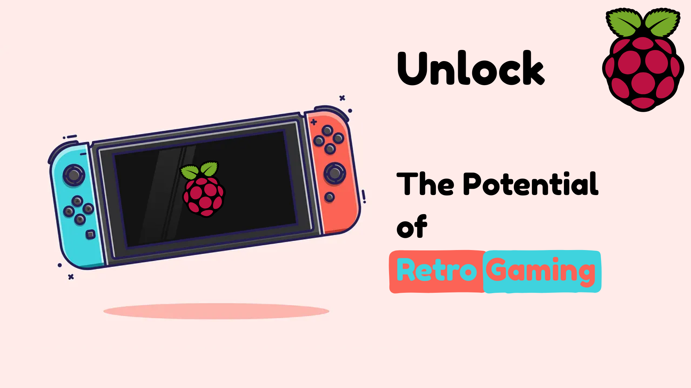
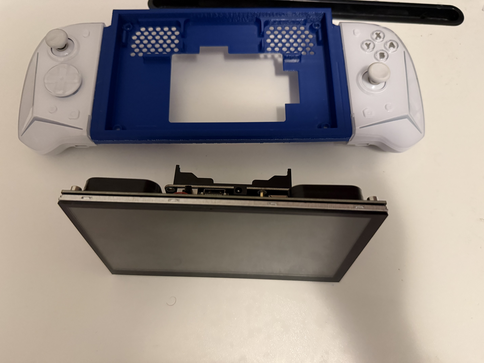
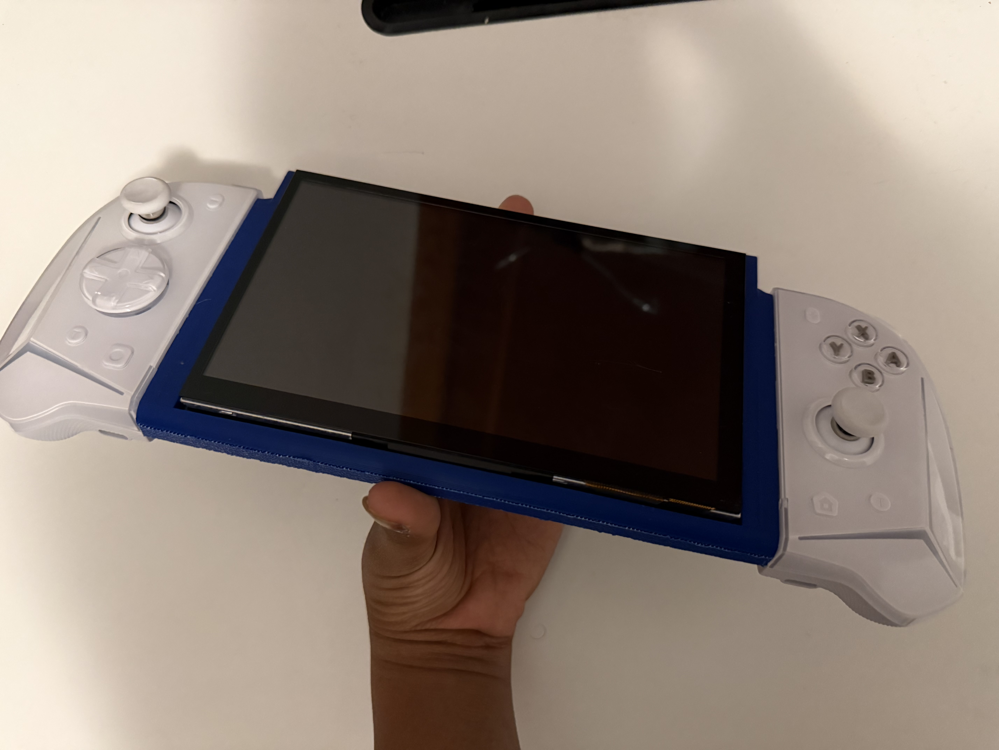

# Raspberry-ECE-Raspberry-Pi-Switch-Chassis-

A Project By Jacob R:
A 3d Printed Mount That Attaches A Raspberry Pi, Screen, Speakers, Battery Pack, And Nintendo Switch Joycon Rails to Craft The Ultimate Retro Gaming Experience

# Parts List
- 1x Raspberry Pi 3b, 4b, or 5b [Or Raspberry Pi 2b With Wifi Dongle]
- 1x Hosyond Raspberry Pi 7 inch Capacitive Touch Display: [https://www.amazon.com/dp/B0BKGCB18T?ref=ppx_yo2ov_dt_b_fed_asin_title&th=1]
- 1x Raspberry Pi WaveShare UPS Uninterruptible Power Delivery Hat: [https://www.amazon.com/dp/B08BRPLY15?psc=1&smid=A50C560NZEBBE&ref_=chk_typ_imgToDp]
- 2x 2.5mm Screws
- 2x 18650 Li Batteries

# Instructions For Assembly
1. 3d print the mount
   
3. Screw in waveshare display to the mount
4. On the back of the mount, place the Raspberry Pi
5. Screw in the Raspberry Pi with 2 2.5mm screws diagonal from each other
6. Loosely slot in the 2mm standoffs on top of the Raspberry Pi (no, they will not screw into the back of the display)
7. Slot The Waveshare UPS HAT into the Raspberry Pi's Gpio equipped with 2x 18650 Li Batteries
8. Screw The Waveshare UPS Hat into the standoffs in the Raspberry Pi
9. Admire Your Work and Enjoy!
    
   
# Connecting to RetroPie
This is the most tedious part. Slide the joycons out of the chassis and hold the pairing button on the sides, making sure that any other devices they could connect to are turned off or have bluetooth disabled. Follow this official opensource guide from RetroPie: [https://retropie.org.uk/docs/Nintendo-Switch-Controllers/]

